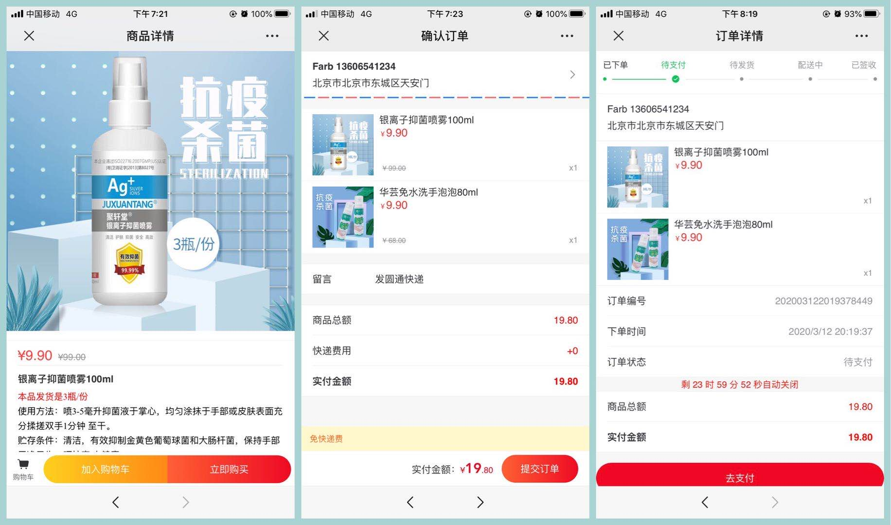

## 特点
> 1. 基于vuejs+axios+vue-router+vant的单页小型商城
> 2. 开箱即用移动端商城。
> 3. 开箱即用，src/data/目录下提供后台接口格式，前端可做二次开发以实现自有业务

## 手机扫描以下二维码在线浏览


## 部分截图展示  





## 技术栈

- [vue cli 3](https://cli.vuejs.org/zh/guide/installation.html)
- [vant](https://github.com/youzan/vant)
- [vue-router](https://router.vuejs.org/zh/installation.html)
- [axios](https://github.com/axios/axios)
- [babel-plugin-import](https://github.com/ant-design/babel-plugin-import)


## 快速上手

```
# 安装 Vue Cli 3
npm install -g @vue/cli

# 安装相关依赖
npm install

# 开发环境运行
npm run serve

# 生成生产环境静态文件
npm run build
```

## 调整src/config/env.js的配置信息
```
baseUrl: 域名地址
dataSources：数据源(local=本地)
```
## src目录说明
- api: 后端接口的请求地址
- assets: 存放一些静态文件
- components: vue的一些组件
- config: 一些配置相关的js文件
- data:后台接口应该返回数据结构
- lib:js类库 
- page:根据业务分类的页面
## 页面
```
- 首页
- 商品
    - 详情
    - 列表
- 购物车
    - 本地缓存
- 提交订单
    - 集成微信支付
- 会员
    - 会员中心
    - 账户管理
	- 绑定手机号
	- 重置密码
	- 修改密码
    - 订单
        - 列表
        - 详情
        - 快递追踪
    - 收货地址
        - 列表
        - 编辑
- 密码登录
- 注册码注册


```

